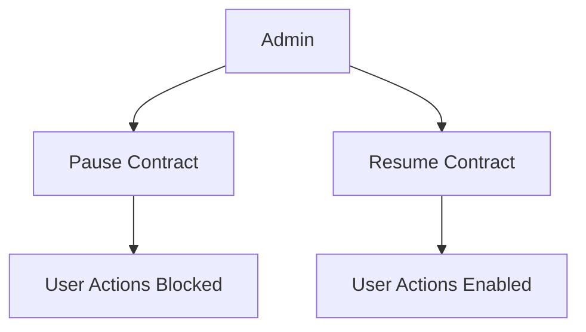

<!-- HEADER ANIMATION -->
<p align="center">
  
</p>

<h1 align="center">🛍️ ChainRewards System</h1>

<p align="center">
  
</p>

---

# 🚀 Project Overview

**ChainRewards System** is a blockchain-powered loyalty and rewards management application developed using **Solidity**, **Python**, **Web3.py**, **Ganache**, and **Truffle**.

The platform simulates a decentralized digital punch-card and rewards ecosystem where store admins manage reward items and mint custom ERC-20 reward coins while users redeem rewards, monitor balances, and interact with the blockchain through terminal and GUI applications.

The project combines:

- ⛓️ Blockchain Development
- 💰 ERC-20 Token System
- 🧠 Smart Contract Logic
- 📊 Blockchain Analytics
- 🖥️ Terminal & GUI Applications
- 🔐 Security & Access Control

---

# ✨ Key Features

- 🛍️ Manage store reward items using smart contracts
- 💰 Custom ERC-20 Reward Point Coin
- 👤 User registration & blockchain profiles
- 🔒 Admin-only protected operations
- 📊 Admin dashboard with blockchain analytics
- 📜 Personal transaction history scanning
- 📈 Popular rewards reporting system
- 🚨 Live blockchain reward purchase alerts
- 📁 CSV balance snapshot exporter
- 🛑 Emergency pause & resume system
- 🔄 Ownership transfer testing
- 🖥️ Terminal-based application
- 🎨 Optional GUI application

---

# 🧠 Smart Contract Architecture

The system is divided into multiple blockchain components:

| Contract | Purpose |
|----------|----------|
| 🛒 StoreRewards.sol | Main reward management logic |
| 💰 RewardPointCoin.sol | ERC-20 custom reward token |
| 🔐 Access Control | Admin-only authorization |
| 🛑 Pause System | Emergency stop mechanism |
| 🔄 Ownership Transfer | Admin ownership migration |

---

# ⛓️ Blockchain Workflow

```mermaid
graph TD

A[Admin] --> B[Deploy Smart Contracts]
B --> C[RewardPointCoin Contract]
B --> D[StoreRewards Contract]

A --> E[Add Reward Items]
A --> F[Mint Reward Coins]

G[User] --> H[Register Account]
H --> I[Redeem Rewards]

I --> J[Blockchain Transaction]

J --> K[Transaction History]
J --> L[Balance Snapshot]
J --> M[Live Alert System]
````

---

# 💰 ERC-20 Reward Point Coin

The project includes a fully custom ERC-20 token called:

## 🪙 Reward Point Coin (RPC)

### Features

* Minted only by the Admin
* Distributed to users as reward points
* Used to redeem store reward items
* Blockchain-based balance tracking
* Integrated with Web3.py balance checking

---

# 👤 User Features

Normal users can:

* Register using wallet address
* Save display names on-chain
* Redeem reward items
* View transaction history
* Check ETH balance
* Check Reward Point Coin balance
* Explore blockchain activity reports

---

# 🔒 Admin Features

The Admin can:

* Add reward items
* Update reward items
* Mint reward coins
* Pause & resume the system
* Batch-add multiple rewards
* View analytics dashboard
* Transfer ownership
* Monitor blockchain activity

---

# 📊 Admin Dashboard

The project includes a Python-based admin dashboard script that scans the blockchain and displays:

* Total reward items
* Total minted coins
* Total blockchain transactions
* Top active wallet addresses

```mermaid
graph LR

A[Blockchain Data] --> B[Admin Dashboard Script]
B --> C[Transaction Analysis]
B --> D[Top Users]
B --> E[Mint Statistics]
```

---

# 📜 Blockchain History & Reports

The system scans blockchain history to generate analytics and reports.

### Included Reports

* 📈 Most popular rewards
* 📜 User activity history
* 💰 Coin & ETH balance snapshots
* 📊 Transaction analytics
* 🔍 Reward redemption tracking

---

# 🚨 Live Alert System

A background Python script continuously monitors blockchain events and prints live alerts whenever reward purchases occur.

### Example Alert

```bash
ALERT: A reward purchase just happened!
```

---

# 🛑 Pause & Resume System

The smart contract includes an emergency stop mechanism.

### Features

* Admin can pause the platform
* User actions become temporarily blocked
* Resume function restores operations
* Protected using Solidity modifiers



---

# 🔄 Ownership Transfer Testing

The project includes automated ownership transfer testing that verifies:

1. Original admin permissions
2. Ownership transfer
3. Permission revocation
4. New admin authorization

---

# 🖥️ Terminal Application

The project includes a command-line application that supports:

* User login & registration
* Reward browsing
* Coin redemption
* Balance checking
* Admin hidden menu
* Blockchain interaction

---

# 🎨 GUI Application

A simple GUI application was developed to make blockchain interaction easier.

### GUI Features

* Reward item visualization
* Balance checking
* User interaction forms
* Admin operations
* Blockchain activity display

---

# 🛠️ Tech Stack

| Category                    | Tools              |
| --------------------------- | ------------------ |
| ⛓️ Blockchain               | Solidity           |
| 🪙 Token Standard           | ERC-20             |
| 🐍 Programming Language     | Python             |
| 🌐 Blockchain Communication | Web3.py            |
| 🧪 Local Blockchain         | Ganache            |
| 📦 Smart Contract Framework | Truffle            |
| 📊 Data Analysis            | Pandas             |
| 🖥️ GUI                     | Tkinter            |
| 📁 Reporting                | CSV Export         |
| 🔐 Security                 | Solidity Modifiers |

---

# 📁 Project Structure

```bash
ChainRewards-System/
│
├── build/
│   └── contracts/
│
├── migrations/
│   ├── 1_initial_migration.js
│   └── 2_deploy_store_rewards.js
│
├── project Crypto/
│   └── contracts/
│       ├── Migrations.sol
│       ├── RewardPointCoin.sol
│       └── StoreRewards.sol
│
├── scripts/
│   └── clean_truffle_interfaces.js
│
├── app.py
├── gui_app.py
├── Admin_dashboard.py
├── transaction_sender.py
├── balance_snapshot.py
├── history_report.py
├── live_alert.py
├── ownership_transfer_test.py
├── security_test.py
├── popular_rewards_report.py
│
├── balance_snapshot.csv
├── balance_snapshot2.csv
├── contract_addresses.txt
├── USERS.txt
│
├── truffle-config.js
├── package.json
├── setup.py
├── README.md
│
└── docx_render_qa/
```

---

# ⚡ How to Run

## 1️⃣ Clone Repository

```bash
git clone https://github.com/YOUR_USERNAME/ChainRewards-System.git
cd ChainRewards-System
```

---

## 2️⃣ Install Python Dependencies

```bash
pip install web3 pandas
```

---

## 3️⃣ Install Truffle Dependencies

```bash
npm install
```

---

## 4️⃣ Start Ganache

Launch Ganache locally and copy the RPC URL.

Example:

```bash
HTTP://127.0.0.1:7545
```

---

## 5️⃣ Compile Smart Contracts

```bash
truffle compile
```

---

## 6️⃣ Deploy Contracts

```bash
truffle migrate
```

---

## 7️⃣ Run Terminal App

```bash
python app.py
```

---

## 8️⃣ Run GUI App

```bash
python gui_app.py
```

---

# 📊 Expected Results

The project generates:

* Blockchain-based reward management
* ERC-20 reward transactions
* User activity tracking
* Admin analytics dashboard
* CSV balance exports
* Live blockchain alerts
* Reward popularity reports
* Secure admin ownership transfer

---

# 🔐 Security Features

* onlyOwner modifier protection
* Admin authorization checks
* Automated security testing
* Emergency pause mechanism
* Ownership transfer validation

---

# 🎯 Future Improvements

* 🌍 Deploy on Ethereum testnet
* 📱 Build a mobile application
* ☁️ Add cloud database integration
* 🔔 Real-time notifications
* 📈 Advanced analytics dashboard
* 🧠 AI-powered customer reward prediction
* 🌐 Web-based decentralized frontend

---

# 💜 Credits

Developed by
**Aya Alaa**
**Doha Mohamed**
**Asmaa Mohamed**
**Sara Mohamed**

---

<!-- FOOTER ANIMATION -->

<p align="center">
  
</p>

