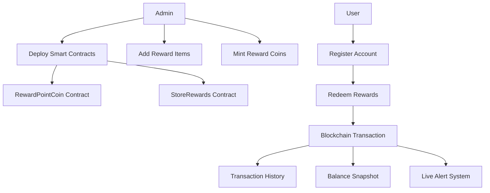
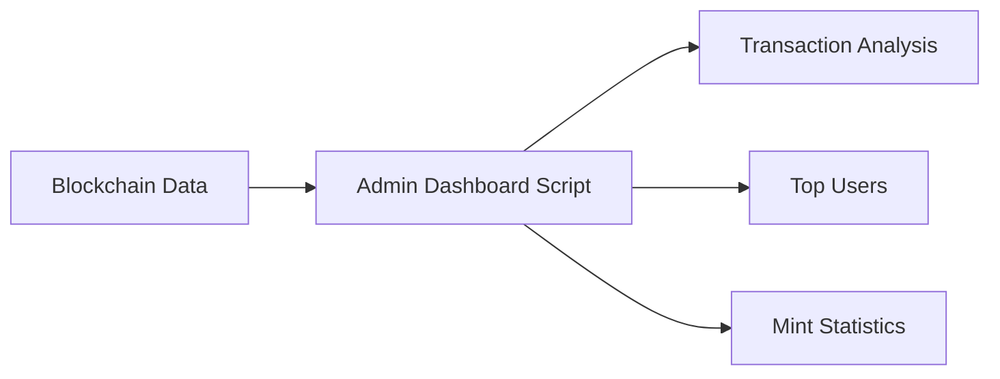
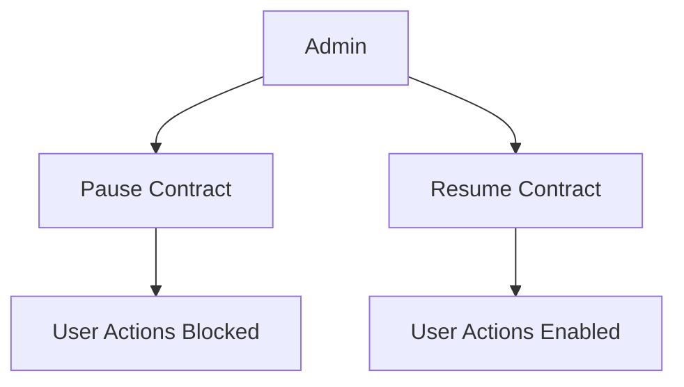

# 🛍️ ChainRewards System

<p align="center">
  
</p>

<p align="center">
  
</p>

---

# 🚀 Project Overview

**ChainRewards System** is a blockchain-powered loyalty and rewards management application built using **Solidity**, **Python**, **Web3.py**, **Ganache**, and **Truffle**.

The platform simulates a decentralized rewards ecosystem where:

* Store admins manage reward items
* Users redeem rewards using custom ERC-20 coins
* Blockchain activity is tracked and analyzed
* Both terminal and desktop GUI applications interact with smart contracts

The project combines:

* ⛓️ Blockchain Development
* 💰 ERC-20 Token System
* 🧠 Smart Contract Logic
* 📊 Blockchain Analytics
* 🖥️ Terminal & GUI Applications
* 🔐 Security & Access Control

---

# ✨ Key Features

* 🛍️ Blockchain-based reward management
* 💰 Custom ERC-20 Reward Point Coin (RPC)
* 👤 User registration & blockchain profiles
* 🔒 Admin-protected operations
* 📊 Blockchain analytics dashboard
* 📜 Transaction & activity history scanning
* 📈 Popular rewards reporting
* 🚨 Live blockchain purchase alerts
* 📁 CSV balance snapshot export
* 🛑 Emergency pause/resume system
* 🔄 Ownership transfer testing
* 🖥️ Terminal application
* 🎨 Desktop GUI application

---

# 🧠 Smart Contract Architecture

| Contract                 | Purpose                      |
| ------------------------ | ---------------------------- |
| 🛒 `StoreRewards.sol`    | Main reward management logic |
| 💰 `RewardPointCoin.sol` | ERC-20 custom reward token   |
| 🔐 Access Control        | Admin authorization          |
| 🛑 Pause System          | Emergency stop mechanism     |
| 🔄 Ownership Transfer    | Admin migration system       |

---

# ⛓️ Blockchain Workflow



---

# 💰 ERC-20 Reward Point Coin

The project includes a fully custom ERC-20 token called:

## 🪙 Reward Point Coin (RPC)

### Features

* Minted only by the admin
* Distributed to users as loyalty points
* Used to redeem rewards
* Blockchain-based balance tracking
* Integrated with Web3.py balance checking

---

# 👤 User Features

Normal users can:

* Register using wallet addresses
* Save display names on-chain
* View all available rewards
* Redeem rewards using RPC
* Check ETH balance
* Check Reward Point Coin balance
* Transfer coins to another address
* View reward details by ID
* Scan blockchain activity history
* Explore transaction reports

---

# 🔒 Admin Features

The admin can:

* Add reward items
* Update reward items
* Batch add rewards
* Batch update rewards
* Mint reward coins
* Pause & resume the system
* Transfer ownership
* View analytics dashboard
* Monitor blockchain activity

---

# 📊 Admin Dashboard

The project includes analytics scripts that scan blockchain activity and display:

* Total rewards
* Total minted coins
* Total transactions
* Top active users
* Popular rewards
* Balance reports



---

# 📜 Blockchain Reports & Analytics

Included reports:

* 📈 Most popular rewards
* 📜 User activity history
* 💰 Coin & ETH balance snapshots
* 📊 Transaction analytics
* 🔍 Reward redemption tracking

---

# 🚨 Live Alert System

A background Python script continuously monitors blockchain events and prints alerts whenever reward purchases occur.

### Example Alert

```bash
ALERT: A reward purchase just happened!
```

---

# 🛑 Pause & Resume System

The smart contract includes an emergency stop mechanism.

### Features

* Admin can pause the platform
* User actions become temporarily blocked
* Resume restores normal operations
* Protected using Solidity modifiers



---

# 🔄 Ownership Transfer Testing

The project includes ownership transfer testing that verifies:

1. Original admin permissions
2. Ownership transfer execution
3. Permission revocation
4. New admin authorization

---

# 🖥️ Applications

## Terminal Application

The terminal app supports:

* User login & registration
* Reward browsing
* Reward redemption
* Balance checking
* Admin hidden menu
* Blockchain interaction

Run using:

```powershell
python app.py
```

---

## 🎨 Desktop GUI Application

The GUI provides a more interactive blockchain experience.

Run using:

```powershell
python gui_app.py
```

### GUI Tabs

#### 👤 User Tab

* Register wallet names
* View rewards
* Buy rewards
* Check balances
* Transfer coins
* Scan address history

#### 🔒 Admin Tab

Unlock using:

```text
crypto2024
```

Admin features:

* Add/update rewards
* Batch add/update rewards
* Mint coins
* Pause/resume contracts
* Transfer ownership

#### ⚙️ System Tab

Displays:

* Contract addresses
* Admin addresses
* Ganache balances
* Total rewards
* Minted coins
* Transaction count
* Top active users
* Popular rewards
* Export `balance_snapshot.csv`

#### 📜 Log Tab

Supports live blockchain alerts.

---

# 🛠️ Tech Stack

| Category                    | Tools              |
| --------------------------- | ------------------ |
| ⛓️ Blockchain               | Solidity           |
| 🪙 Token Standard           | ERC-20             |
| 🐍 Language                 | Python             |
| 🌐 Blockchain Communication | Web3.py            |
| 🧪 Local Blockchain         | Ganache            |
| 📦 Smart Contract Framework | Truffle            |
| 📊 Data Analysis            | Pandas             |
| 🖥️ GUI                     | Tkinter            |
| 📁 Reporting                | CSV Export         |
| 🔐 Security                 | Solidity Modifiers |

---

# 📁 Project Structure

```bash
ChainRewards-System/
│
├── build/
│   └── contracts/
│
├── migrations/
│   ├── 1_initial_migration.js
│   └── 2_deploy_store_rewards.js
│
├── project Crypto/
│   └── contracts/
│       ├── Migrations.sol
│       ├── RewardPointCoin.sol
│       └── StoreRewards.sol
│
├── scripts/
│   └── clean_truffle_interfaces.js
│
├── app.py
├── gui_app.py
├── Admin_dashboard.py
├── transaction_sender.py
├── balance_snapshot.py
├── history_report.py
├── live_alert.py
├── ownership_transfer_test.py
├── security_test.py
├── popular_rewards_report.py
│
├── balance_snapshot.csv
├── contract_addresses.txt
├── USERS.txt
│
├── truffle-config.js
├── package.json
├── setup.py
├── README.md
│
└── docx_render_qa/
```

---

# ⚙️ Requirements

* Ganache running on:

```text
HTTP://127.0.0.1:7545
```

* Python
* Node.js & npm
* Truffle
* Python packages:

  * `web3`
  * `py-solc-x`
  * `pandas`

---

# ⚡ Setup Instructions

## 1️⃣ Clone Repository

```bash
git clone https://github.com/YOUR_USERNAME/ChainRewards-System.git
cd ChainRewards-System
```

---

## 2️⃣ Install Python Dependencies

```bash
pip install web3 py-solc-x pandas
```

---

## 3️⃣ Install Node Dependencies

```bash
npm install
```

---

## 4️⃣ Start Ganache

Launch Ganache and ensure the RPC server is:

```text
HTTP://127.0.0.1:7545
```

---

# 🚀 Deployment Options

## Option 1 — Python Setup Script

Run:

```powershell
python setup.py
```

The script will:

* Deploy `RewardPointCoin`
* Deploy `StoreRewards`
* Add sample rewards
* Mint sample coins
* Save contract addresses to:

```text
contract_addresses.txt
```

---

## Option 2 — Truffle Deployment

Compile contracts:

```powershell
truffle compile
```

Deploy contracts:

```powershell
truffle migrate --network development --reset
```

The migration:

* Deploys all contracts
* Links admin permissions
* Adds fake rewards
* Mints sample RPC
* Updates:

```text
project Crypto\contract_addresses.txt
```

If Ganache displays interface contracts as `Not Deployed`, clean them using:

```powershell
node scripts\clean_truffle_interfaces.js
```

Or:

```powershell
npm run migrate:clean
```

---

# ▶️ Running The Apps

## Run Terminal App

```powershell
python app.py
```

## Run GUI App

```powershell
python gui_app.py
```

---

# 🧪 Background & Testing Scripts

```powershell
python Admin_dashboard.py
python history_report.py
python balance_snapshot.py
python security_test.py
python ownership_transfer_test.py
```

---

# 🚨 Testing Live Alerts

Open two PowerShell windows.

### Window 1

```powershell
python live_alert.py
```

### Window 2

```powershell
python app.py
```

Buy a reward from the app.

The alert window should print:

```bash
ALERT: A reward purchase just happened!
```

---

# 🔐 Security Features

* `onlyOwner` modifier protection
* Admin authorization checks
* Emergency pause mechanism
* Ownership transfer validation
* Automated security testing

---

# 📊 Expected Results

The project provides:

* Blockchain-based loyalty management
* ERC-20 reward transactions
* User activity tracking
* Admin analytics
* CSV balance exports
* Live blockchain alerts
* Secure ownership transfer

---

# 🎯 Future Improvements

* 🌍 Ethereum testnet deployment
* 📱 Mobile application
* ☁️ Cloud database integration
* 🔔 Real-time notifications
* 📈 Advanced analytics dashboard
* 🧠 AI-powered reward prediction
* 🌐 Web-based frontend

---

# ⚠️ Important Notes

* If Ganache is restarted, rerun:

```powershell
python setup.py
```

* If an address shows `0 ETH`, use a fresh Ganache address.
* Keep ownership on Account 1 for easier admin testing.
* `Pause` blocks reward actions and user registration.
* Ownership transfer also transfers coin minting authority.

---

# 💜 Credits

Developed by:

* **Aya Alaa**
* **Doha Mohamed**
* **Asmaa Mohamed**
* **Sara Mohamed**

---

<p align="center">
  
</p>
